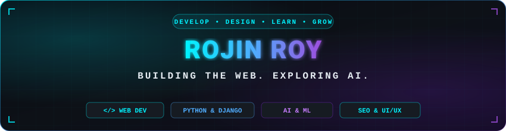

<!-- ══════════════════════════════════════════════════════════════════════════ -->
<!-- 🔧 CUSTOMIZATION: Replace "rojinroyjo24" with your GitHub username      -->
<!--    wherever it appears. Update links, stats tokens, and images as needed -->
<!-- ══════════════════════════════════════════════════════════════════════════ -->

<div align="center">

<!-- ── Custom Cyberpunk Header Banner (Self-hosted SVG — 100% Reliable & Fast) ── -->


<br/><br/>

<!-- ── Dynamic Typing SVG (Single-Line Cycle — No Overlap / Clipping) ── -->
<a href="https://git.io/typing-svg">
  
</a>

<p align="center">
  <strong>⚡ <code>Building the Web. Exploring AI. — One commit at a time.</code> ⚡</strong>
</p>

<!-- ── Quick Highlights Badges ── -->
<p align="center">
  
  
  
</p>

<!-- ── Social Connect Badges (Markdown Format: No Underline Artifacts) ── -->
<p align="center">
  <a href="https://linkedin.com/in/rojinroy" target="_blank"></a>&nbsp;
  <a href="https://github.com/rojinroyjo24" target="_blank"></a>&nbsp;
  <a href="https://www.instagram.com/the.shutterhead" target="_blank"></a>&nbsp;
  <a href="mailto:rojinroyjo24@gmail.com"></a>
</p>


</div>

<br/>

<!-- ─────────────────────────── ABOUT ME ─────────────────────────── -->

## ⚡ About Me

I'm a **Web Developer & Python / Django Engineer** based in **Thodupuzha, Kerala, India** — an MCA graduate passionate about engineering robust web architectures, optimizing search performance, and integrating intelligent AI/ML solutions.

- 💼 Currently working as a **Web Developer** at **Mostech Business Solutions**
- 🎓 **MCA Graduate** from **Mangalam College of Engineering** (CGPA: **8.12**) under APJ Abdul Kalam Technological University
- 🧪 Researched and engineered an **AI-powered Deepfake Video Detection** system using **PyTorch**, **OpenCV**, and **Django**
- 🚀 Core specialties: **Full-Stack Web Development (Python & Django)**, **Website SEO Optimization**, and **AI/ML Integration**
- 🏏 Beyond coding: Leading cricket teams as captain, capturing perspectives through photography, and designing graphics

<br/>

<!-- ─────────────────────────── TECH MATRIX ─────────────────────────── -->

## 🛠️ Tech Matrix

<details open>
<summary><b>Languages & Core</b></summary>
<br/>


</details>

<details open>
<summary><b>Frameworks & Backend Architecture</b></summary>
<br/>


</details>

<details open>
<summary><b>AI / Deep Learning & Data Science</b></summary>
<br/>


</details>

<details open>
<summary><b>Web Optimization & Design</b></summary>
<br/>


</details>

<details open>
<summary><b>Databases & Storage</b></summary>
<br/>


</details>

<details open>
<summary><b>Tools, DevOps & Platforms</b></summary>
<br/>


</details>

<br/>

<!-- ─────────────────────────── EXPERIENCE ─────────────────────────── -->

## 💼 Experience

### 🔹 Web Developer · **Mostech Business Solutions**
`📅 Present`

- Engineering full-stack web applications utilizing **Python, Django, and Modern Web Architectures**
- Implementing strategic **Website SEO Optimization**, Core Web Vitals enhancements, and organic performance tuning
- Architecting robust RESTful API endpoints, relational database management, and responsive client-side interfaces

---

### 🔹 Python Full Stack Developer Intern · **Quest Innovative Solutions Pvt. Ltd.**

- Architected a **Django-based Student Management System** with role-based auth, CRUD operations & relational DB design
- Built **RESTful APIs** using Django REST Framework and a Flask-based CRUD application with SQLite
- Developed GUI desktop applications with **Tkinter** — Calculator, Registration Form & menu-driven systems
- Applied core Python: **OOP, data structures, algorithms, socket programming & email automation**

---

### 🔹 Web Developer Intern · **HASHCOVET**
`📅 Jan 2025 – Apr 2025`

- Developed dynamic web applications using **PHP, MySQL, HTML5, CSS3 & JavaScript**
- Collaborated cross-functionally on **testing, debugging & feature enhancements**
- Maintained clean version control workflows and release tracking using **Git & GitHub**

<br/>

<!-- ─────────────────────────── PROJECTS ─────────────────────────── -->

## 🚀 Featured Projects

<table>
  <tr>
    <td width="50%" valign="top">
      <h3 align="center">🔍 Deepfake Video Detection</h3>
      <p align="center">
        AI-powered system to detect manipulated video content using <strong>Deep Learning</strong>. Implements face extraction, frame sequencing, and temporal feature analysis for authenticity verification.
      </p>
      <p align="center">
        
        
        
        
      </p>
      <!-- 🔧 CUSTOMIZATION: Add repo link → <p align="center"><a href="https://github.com/rojinroyjo24/REPO"><b>View Project →</b></a></p> -->
    </td>
    <td width="50%" valign="top">
      <h3 align="center">🏫 College Placement Cell</h3>
      <p align="center">
        Full-featured <strong>job portal</strong> enabling students to search & apply for career opportunities with dedicated role modules for Students, Companies, and Administrators.
      </p>
      <p align="center">
        
        
        
        
      </p>
      <!-- 🔧 CUSTOMIZATION: Add repo link → <p align="center"><a href="https://github.com/rojinroyjo24/REPO"><b>View Project →</b></a></p> -->
    </td>
  </tr>
  <tr>
    <td width="50%" valign="top">
      <h3 align="center">⚖️ Legal Advisor Portal</h3>
      <p align="center">
        Comprehensive platform for <strong>lawyer listings, client ratings & appointment booking</strong> featuring real-time client-lawyer chat and an integrated IPC section reference database.
      </p>
      <p align="center">
        
        
        
      </p>
      <!-- 🔧 CUSTOMIZATION: Add repo link → <p align="center"><a href="https://github.com/rojinroyjo24/REPO"><b>View Project →</b></a></p> -->
    </td>
    <td width="50%" valign="top">
      <h3 align="center">📋 Student Management System</h3>
      <p align="center">
        Django-based administrative portal engineered with <strong>role-based authentication</strong>, full CRUD capabilities, RESTful API endpoints & relational database design.
      </p>
      <p align="center">
        
        
        
      </p>
      <!-- 🔧 CUSTOMIZATION: Add repo link → <p align="center"><a href="https://github.com/rojinroyjo24/REPO"><b>View Project →</b></a></p> -->
    </td>
  </tr>
</table>

<br/>

<!-- ─────────────────────── CURRENTLY LEARNING ─────────────────────── -->

## 📚 Currently Learning & Exploring

- 🤖 **Machine Learning & Deep Learning** — Building computer vision and predictive models from scratch
- ☁️ **Cloud Deployment & DevOps** — Docker containerization, AWS orchestration, and CI/CD pipelines
- ⚛️ **Modern Frontend (React.js)** — Deepening component state architectures and reactive UI designs
- 🔌 **Scalable API Architecture** — High-throughput REST & GraphQL service patterns

<br/>

<!-- ─────────────────────── ACHIEVEMENTS ─────────────────────── -->

## 🏆 Honors & Achievements

- 🚀 **NASA Space Apps Challenge** — Participated in the premier global hackathon, solving real-world challenges using open science data
- 🏕️ **NCC National Trekking Camp** — Represented state unit, demonstrating leadership, endurance, and operational discipline
- 🏏 **Inter-College Cricket Fest** — Led team as **Captain** to **Runner-Up** finish
- 📸 **Photography Competition Winner** — Recognized for exceptional visual composition and storytelling

<br/>

<!-- ─────────────────────────── GITHUB STATS ─────────────────────────── -->

## 📊 System Metrics & Activity

<div align="center">

<!-- ── Streak Stats (Radical / Neon Cyberpunk Theme) ── -->


<br/><br/>

<!-- ── Profile Summary Cards (Radical Theme) ── -->


<br/>


<br/><br/>

<!-- ── GitHub Readme Stats & Top Languages ── -->


<br/><br/>

<!-- ── Snake Contribution Animation ── -->
<!-- Generated by .github/workflows/snake.yml — auto-updates every 12 hours -->
<picture>
  <source media="(prefers-color-scheme: dark)" srcset="https://raw.githubusercontent.com/rojinroyjo24/rojinroyjo24/output/github-snake-dark.svg" />
  <source media="(prefers-color-scheme: light)" srcset="https://raw.githubusercontent.com/rojinroyjo24/rojinroyjo24/output/github-snake.svg" />
  
</picture>

</div>

<br/>

<!-- ─────────────────────────── TERMINAL BIO ─────────────────────────── -->

## ⚡ System Profile

```yaml
identity: "Rojin Roy"
location: "Thodupuzha, Kerala, India 🌿"
education: "MCA · Mangalam College of Engineering (CGPA: 8.12)"
current_role: "Web Developer @ Mostech Business Solutions"
core_stack:
  backend: ["Python", "Django", "Django REST Framework", "Flask"]
  ai_ml: ["PyTorch", "OpenCV", "NumPy", "Pandas"]
  frontend: ["JavaScript", "HTML5", "CSS3", "Bootstrap", "React (Learning)"]
  specialties: ["Website SEO Optimization", "UI/UX Design", "REST APIs"]
  databases: ["MySQL", "SQLite", "PostgreSQL"]
hobbies: ["Cricket 🏏", "Photography 📸", "Graphic Design 🎨", "Football ⚽"]
motto: "Building the Web. Exploring AI."
fun_fact: "From NCC National Trekking expeditions to NASA Space Apps Hackathon!"
```

<br/>

<!-- ─────────────────────────── CONNECT ─────────────────────────── -->

<div align="center">

## 🌐 Connect Protocol

Always open to discussing new engineering challenges, collaborations, and open-source ideas.

<p align="center">
  <a href="https://linkedin.com/in/rojinroy" target="_blank"></a>&nbsp;
  <a href="mailto:rojinroyjo24@gmail.com"></a>&nbsp;
  <a href="https://www.instagram.com/the.shutterhead" target="_blank"></a>&nbsp;
  <a href="https://github.com/rojinroyjo24" target="_blank"></a>
</p>

<!-- 🔧 CUSTOMIZATION: Uncomment and update when you have a portfolio site -->
<!-- <a href="https://your-portfolio.com"></a> -->

<br/>

<!-- ── Glowing Divider ── -->


</div>